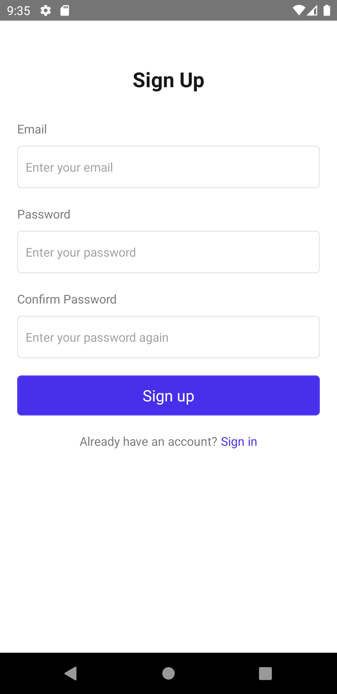
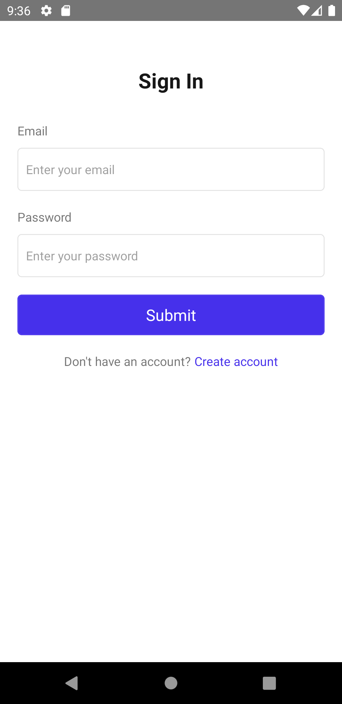
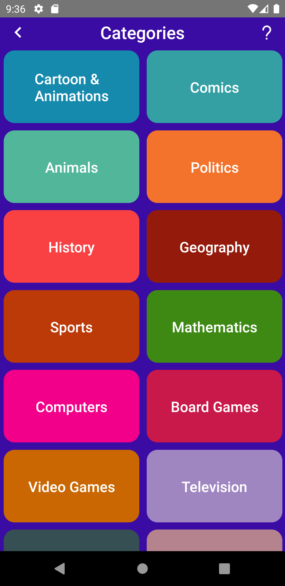
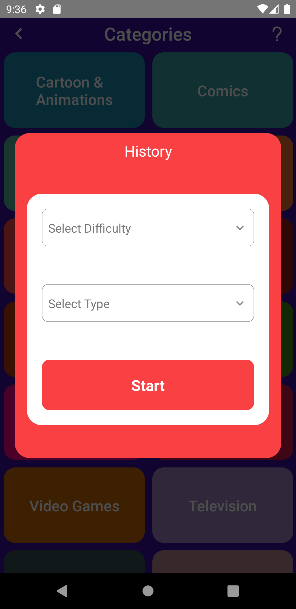
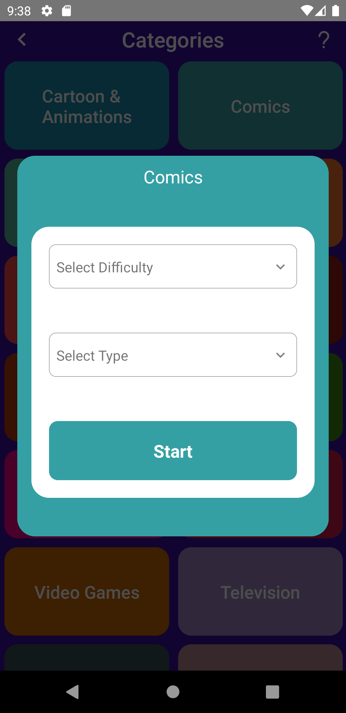
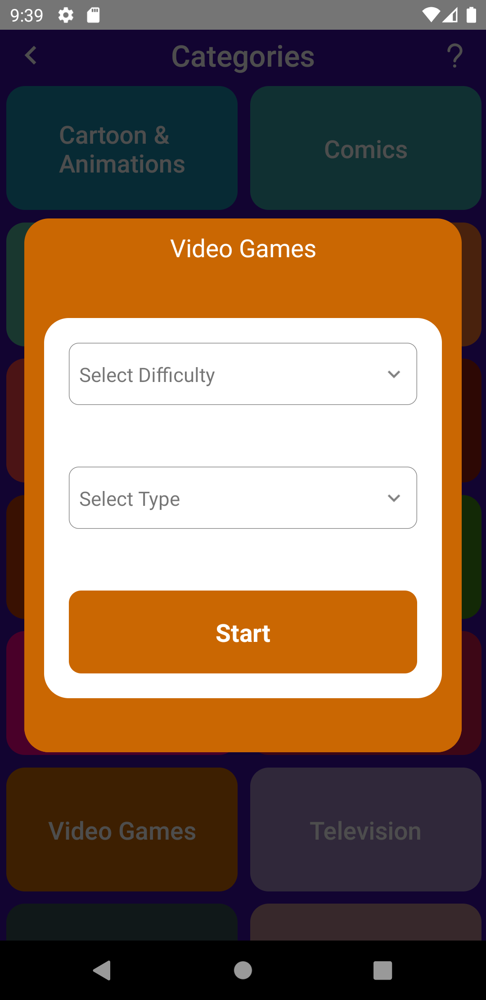
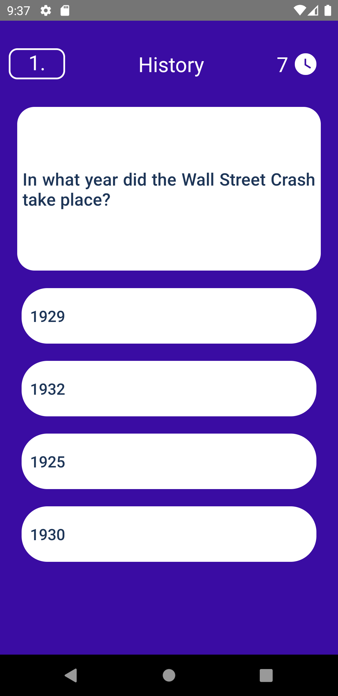

# React Native Patika Trivia App

The project is a mobile application that allows users to answer questions in different categories and see their results. The application is developed with React Native and Firebase.


## Features

- Users can register and login.
- Can upload profile pictures from gallery.
- Can start a challenge by choosing category, difficulty and question type.
- There is 100 seconds of time for 10-question challenges and when the time is over, it is automatically redirected to the Results page.
- If the user wishes, can share the challenge score or continue without sharing.
- Users can see the leaderboard.


## Screenshots











## Installation

To run the Todo app on your local machine, you need to have Node.js and npm installed. You also need to have an Android or iOS emulator installed on your computer or a physical device connected to your computer. Follow these steps to install and run the application:

1. Clone the repository:

   ```bash
   git clone https://github.com/yusufie/react-native-patika-trivia.git
    ```

2. Navigate to the project directory:

   ```bash
   cd react-native-patika-trivia
   ```

3. Install the dependencies:

   ```bash
    npm install
    ```

4. Run the development server:

   ```bash
   npm run start
   ```

6. Run the application on an emulator or a physical device:

   ```bash
   npm run android
   ```

   or

   ```bash
   npm run ios
   ```

Open the emulator or connect your physical device to your computer to run the application. The application will be automatically installed and launched on the device.


## Tools & Resources

- React-navigation
- React Native Firebase auth
- React Native Firebase database
- React-Native-vector-icons
- React-Native-Modal
- React-Native-Element-Dropdown


## Contributing

Contributions are welcome! If you find any issues or have suggestions for improvements, please open an issue or submit a pull request. Follow these steps to contribute:

1. Fork the repository.
2. Create a new branch for your feature or bug fix.
3. Make the necessary changes and commit those changes.
4. Push your code to your forked repository.
5. Submit a pull request describing the changes you made.

Please make sure to follow the existing code style and conventions.


